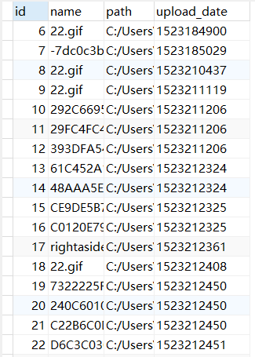

> ###  h5移动端图片上传

##### 后台用原生Node写的服务端, 并将该web项目部署到了阿里云服务器上。

##### 实现：

* ##### 简单的路由

* ##### 静态文件的处理和渲染

* ##### 将前端的图片文件接受并存入本地

* ##### 向mysql中插入每次上传图片的相关信息

* ##### 前端h5页面的一些特效

##### 下面是几张效果图 ：

---

---

##### 向mysql数据库中插入数据：

##### demo浏览地址：

http://cosmos-alien.com:8080

##### 自己弄个域名还要备案好久所以先用的natapp映射给外网访问  ( 逃......

> ##### PS: 页面主要适配的移动端, 如果PC查看的话请按 f12 切换到移动端视角......

